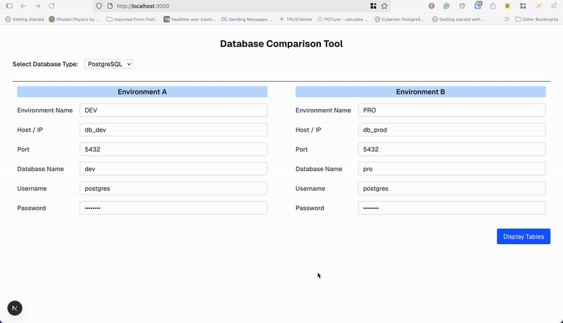

# Diff Tool 🛠️

> A web-based tool to compare database changes (DML) between **DEV** and **PRO** environments during release, with direct execution, logging, and multi-database support.

---

## 📌 Overview
**Diff Tool** helps teams ensure database changes are synchronized between environments by generating and applying **DML differences**.  
It supports both **PostgreSQL** and **MySQL**, and is designed to run entirely from the browser — no local DB client required.

**Goal:** Quickly identify, review, and optionally execute the exact DML changes that will be applied to your production environment during deployment.

---

## 🎥 Demo



> The GIF above shows:
> 1. Selecting **DEV** and **PRO** databases
> 2. Generating the SQL **diff**
> 3. Executing queries directly from the browser
> 4. Viewing the **execution log**


## ✨ Features
- 🔍 **Diff Generator** – Compare **DEV** and **PRO** environments and see the SQL changes.
- ⚡ **Direct Execution** – Run generated DMLs on selected environments from the browser.
- 📝 **Logging** – Keep track of executed queries for audit purposes.
- 🌐 **Multi-DB Support** – Works with **PostgreSQL** and **MySQL**.
- 🖥 **Browser-based** – No local database tools needed.
- 🛡 **Environment Isolation** – Connects only to configured environments (DEV, PRO, UAT, etc.).

---

## 🛠 Tech Stack
**Frontend**
- [React 19](https://react.dev/)
- [Next.js](https://nextjs.org/)
- TailwindCSS (UI styling)

**Backend**
- Node.js
- API routes for DB connection and diff generation
- Environment variables for secure DB credentials

**Databases**
- PostgreSQL
- MySQL

**Containerization**
- Docker & Docker Compose (multi-environment setup)
- `.env` configuration for DEV/PRO/UAT DBs

---

## 🚀 Getting Started

### 1️⃣ Clone the repo
```bash
git clone https://github.com/m-thirumal/diff-tool.git
cd diff-tool

npm run dev
# or
yarn dev
# or
pnpm dev
# or
bun dev
```

Open [http://localhost:3000](http://localhost:3000) with your browser to see the result.

## Update `.env` file for default values (OR) for docker(Mandaotry)
```

```

## Start with Docker (Development (hot reload))
```
docker compose up --build

docker compose --profile dev up --build
```

* Uses Dockerfile.dev

* Mounts your local code (CODE_MOUNT=.) for live reload

* Runs `npm run dev`

#### Production
```
DOCKERFILE=Dockerfile CODE_MOUNT=/app START_CMD="npm start" NODE_ENV=production docker compose --profile prod up --build
```

* Uses Dockerfile (optimized build)

* No code mount → container has its own copy of the app

* Runs `npm start`

## Reset the volume (recommended for dev)

```
docker compose down -v
docker compose up --build
```

This will delete `pgdata_dev` and `pgdata_prod` volumes, wiping all data and reinitializing with the new password.

## Project Structure

```bash
/diff-tool
 ├── /seed                   # Database seed/init scripts
 ├── /pages/api              # Next.js API routes
 ├── /components             # React components
 ├── /contexts               # React Contexts for DB config
 ├── docker-compose.yml      # Multi-environment setup
 ├── .env                    # Environment variable sample
 └── README.md
```

# Example Flow

* Select DEV and PRO environments.
* Click Generate Diff to see DML differences.
* Review and Execute if approved.
* Logs are automatically recorded.

📜 License

MIT License – feel free to use, modify, and contribute.

🤝 Contributing
PRs are welcome!
If you’d like to add features (e.g., schema diff, rollback support), just open an issue first to discuss.
